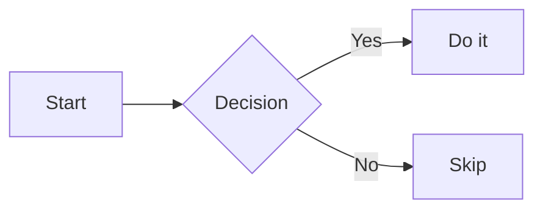
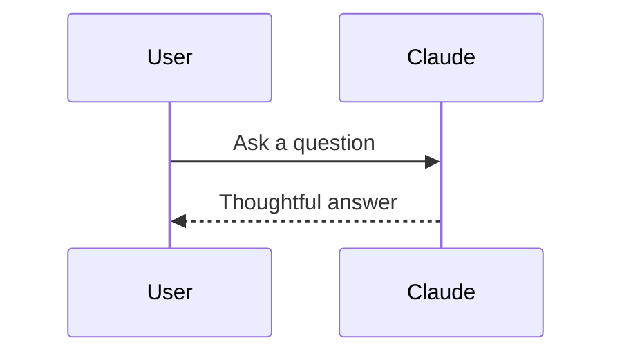
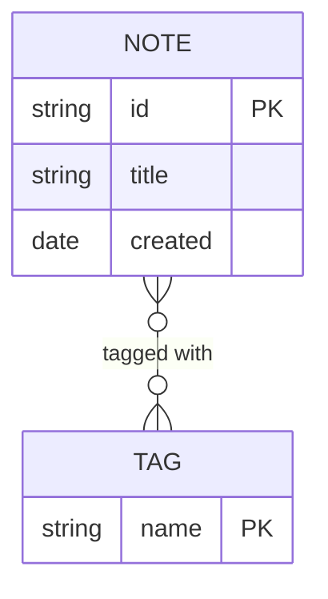

# Beautiful Mermaid — Obsidian Plugin

Replaces Obsidian's built-in Mermaid renderer with [beautiful-mermaid](https://github.com/lukilabs/beautiful-mermaid), producing crisp themed SVG output that automatically follows your vault theme — with pan, zoom, copy, and Excalidraw export built in.

---

## Features

- **Drop-in replacement** — intercepts all ` ```mermaid ` blocks automatically in Reading Mode, no syntax changes required
- **Auto mode** — maps Obsidian's CSS variables to diagram colors; diagrams update live when you toggle light/dark mode, no re-render needed
- **15 curated themes** — 9 dark, 6 light; Tokyo Night, Catppuccin, Nord, Dracula, GitHub, Solarized, and more
- **Pan and zoom** — drag to pan; scroll wheel zooms; pinch gesture zooms on trackpad; double-click to reset; toolbar −, ⊙, + buttons
- **Copy as SVG** — copies the raw SVG string to your clipboard
- **Copy as PNG** — renders at 2× device pixel ratio; resolves CSS variables to literal colors so the image is self-contained
- **Export to Excalidraw** — converts diagrams into fully editable `.excalidraw` files (nodes, connectors, labels as real shapes). Supports flowchart, sequence, class, ER, and state diagrams. Unsupported types embed the SVG as an image element. Opens the file immediately after creation
- **Error state** — shows a styled inline message and the raw source if a diagram fails to parse
- **Configurable font** — any font available in Obsidian (system fonts, theme fonts, Google Fonts via CSS snippets)
- **Transparent background** — lets the note background show through

---

## Screenshots

*(Reading Mode — catppuccin-mocha theme)*

---

## Installation

### Community Plugin Browser *(once listed)*

1. **Settings → Community Plugins → Browse**
2. Search **Beautiful Mermaid**
3. Install → Enable

### Manual

1. Download `main.js`, `manifest.json`, `styles.css` from the [latest release](https://github.com/darthkamal/beautiful-mermaid-plugin/releases)
2. Create `.obsidian/plugins/beautiful-mermaid/` in your vault
3. Copy the three files into that folder
4. Reload Obsidian → **Settings → Community Plugins** → enable **Beautiful Mermaid**

---

## Usage

Write Mermaid diagrams exactly as you normally would. Switch to Reading Mode to see them rendered.

````markdown

````

````markdown

````

````markdown

````

Hover any rendered diagram to reveal the toolbar (zoom controls, SVG, PNG, Excalidraw).

---

## Settings

**Settings → Community Plugins → Beautiful Mermaid → Options**

| Setting | Description |
|---------|-------------|
| **Render mode** | `Auto` — follows vault theme via CSS variables, updates live on theme toggle. `Built-in theme` — fixed color palette |
| **Theme** | *(Built-in mode only)* Choose from 15 themes |
| **Font family** | Font for all diagram text. Default: `Inter` |
| **Transparent background** | Removes background fill. Pairs well with Auto mode |

> Settings take effect for newly opened notes or after toggling Reading Mode off and on for already-open notes.

### How Auto Mode Works

In Auto mode the plugin passes Obsidian's CSS custom properties directly to beautiful-mermaid. Because these are embedded as `var()` references inside the SVG — and the SVG lives in the DOM — theme changes cascade automatically:

| Obsidian variable | Diagram role |
|---|---|
| `--background-primary` | Diagram background |
| `--text-normal` | Text and node labels |
| `--interactive-accent` | Arrowheads and highlights |
| `--text-muted` | Edge labels and secondary text |
| `--background-modifier-border` | Node and group borders |
| `--background-secondary` | Node fill tint |

### Available Themes *(Built-in mode)*

**Dark:** `zinc-dark` · `tokyo-night` · `tokyo-night-storm` · `catppuccin-mocha` · `nord` · `dracula` · `one-dark` · `github-dark` · `solarized-dark`

**Light:** `zinc-light` · `tokyo-night-light` · `catppuccin-latte` · `nord-light` · `github-light` · `solarized-light`

---

## Known Limitations

**Live Preview (Edit / Live Preview mode) is disabled.** Reading Mode works fully. Live Preview was implemented using a CodeMirror 6 `ViewPlugin` with `block: true` replacement decorations, but this triggers an uncaught error inside CM6's internal decoration resolution pipeline — surfaced by Obsidian as a "failed to open the file" crash. The error occurs in CM6 internals after plugin code returns, so it cannot be caught with `try/catch`. Live Preview will be re-enabled once the root cause is diagnosed.

---

## Bundle Size

`main.js` is ~9.4 MB. This is larger than a typical Obsidian plugin.

The bulk comes from [`@excalidraw/mermaid-to-excalidraw`](https://github.com/excalidraw/mermaid-to-excalidraw), which ships a full Excalidraw rendering engine and its own Mermaid parser in order to produce editable shapes rather than a flat image. Obsidian plugins must ship as a single `main.js` — there is no multi-chunk loading mechanism — so this dependency cannot be deferred or split out, even though it is only used when you click the Excalidraw export button. A future version may extract Excalidraw export into a separate optional companion plugin to reduce the core bundle size.

---

## Building from Source

```bash
cd export/final/beautiful-mermaid-plugin
npm install
npm run build    # production bundle → main.js
npm run dev      # watch mode with sourcemaps
```

Requires Node.js 18+. Uses esbuild; `@codemirror/view` and `@codemirror/state` are externalized (provided by Obsidian at runtime).

---

## File Structure

```
beautiful-mermaid-plugin/
├── main.ts              ← TypeScript source
├── main.js              ← Compiled output (install this)
├── manifest.json        ← Plugin metadata
├── styles.css           ← Diagram container and toolbar styles
├── package.json         ← Build dependencies
├── tsconfig.json        ← TypeScript config
└── esbuild.config.mjs   ← Bundler config
```

---

## Credits

Powered by [beautiful-mermaid](https://github.com/lukilabs/beautiful-mermaid).

Excalidraw export via [@excalidraw/mermaid-to-excalidraw](https://github.com/excalidraw/mermaid-to-excalidraw).

---

## License

MIT © [darthkamal](https://github.com/darthkamal)
